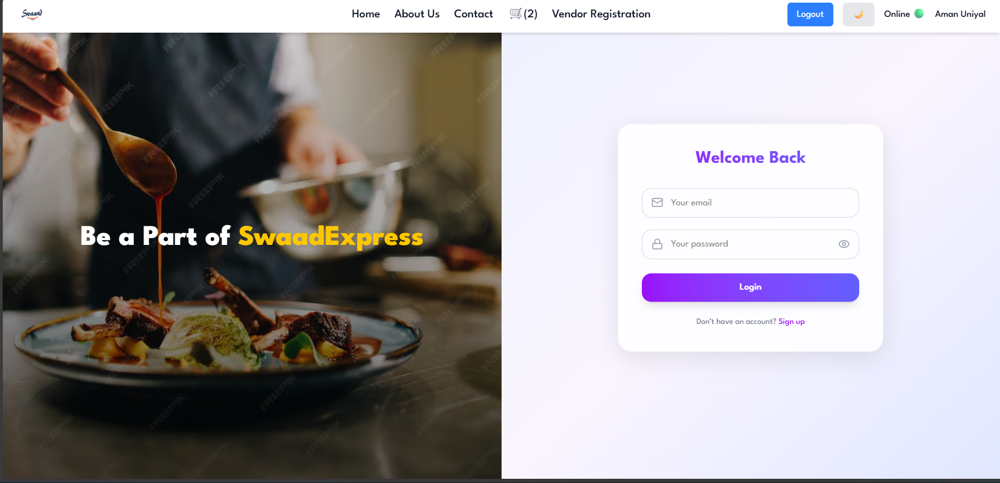

🍛 Swaad Express – Indian Food Ordering Platform (Frontend)

* Swaad Express is a modern and visually rich Indian food ordering web application (frontend) crafted to showcase the diversity of authentic Indian cuisine.
The platform enables users to explore restaurants, discover regional dishes, manage their cart, and enjoy a seamless ordering experience — all wrapped in a clean Netflix-style UI with Dark/Light Mode support.

✨ Key Features
🏠 Home & Restaurant Discovery

* Explore Indian restaurants from multiple regions

* Modern, responsive UI inspired by top food delivery apps

* Smooth navigation with fast page transitions

🍽️ Rich Indian Cuisine

* North Indian, South Indian, Street Food, Sweets & more

* Detailed restaurant menus with pricing and visuals

* Category-wise food browsing for easy discovery

🛒 Smart Cart System

* Instantly add or remove food items

* Quantity control for each item

* Real-time cart updates using global state

🔐 Authentication

* Secure Login & Sign-Up flow

* Persistent user sessions
* 
* Protected routes for authenticated users

🧑‍🍳 Vendor / Restaurant Registration

* Restaurant owners can register as vendors

* Restaurant listing & menu management

* Admin features planned for future releases

🌙 Dark Mode / ☀️ Light Mode

* Seamless theme switching

* Smooth UI animations and transitions

* Comfortable browsing for both day & night users

🛠️ Tech Stack

* Frontend: React.js, Tailwind CSS

* State Management: Redux Toolkit
* 
* Routing: React Router

* Backend / APIs: Firebase

* Authentication: Firebase Auth

* Hosting: Firebase Hosting

📸 Application Screenshots

## 🏠 Home Page

---

## 🍴 Restaurants

---

## 📖 Restaurant Menu

---

## 📖 Restaurant Menu

---

## 📖 About Us

---

## 🛒 Cart

---

## 📞 Contact Us

---

## 💬 Reviews

---

## 🔐 Login

