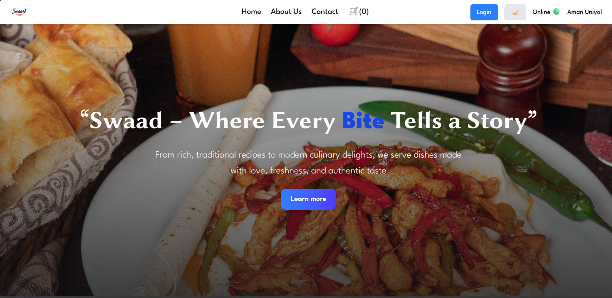
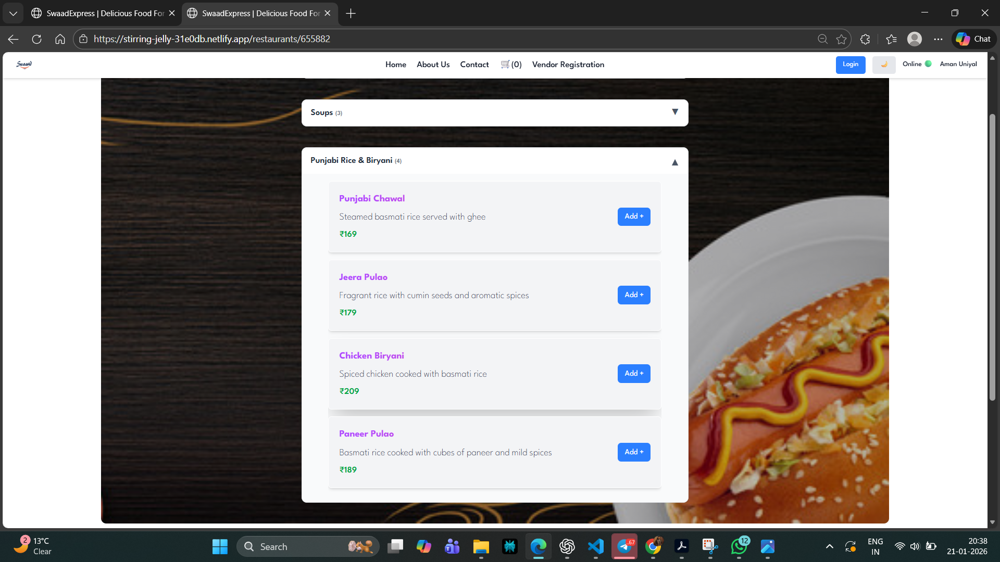
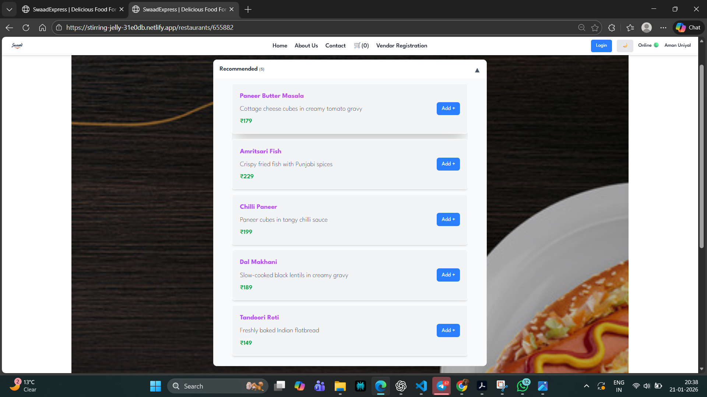
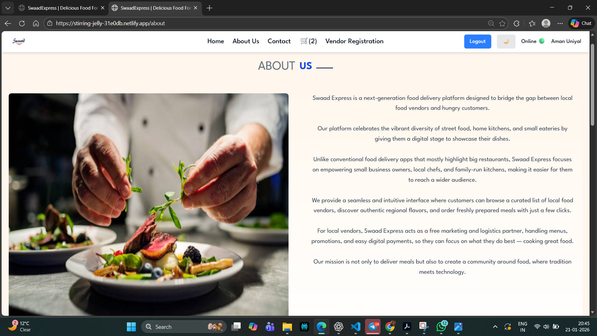
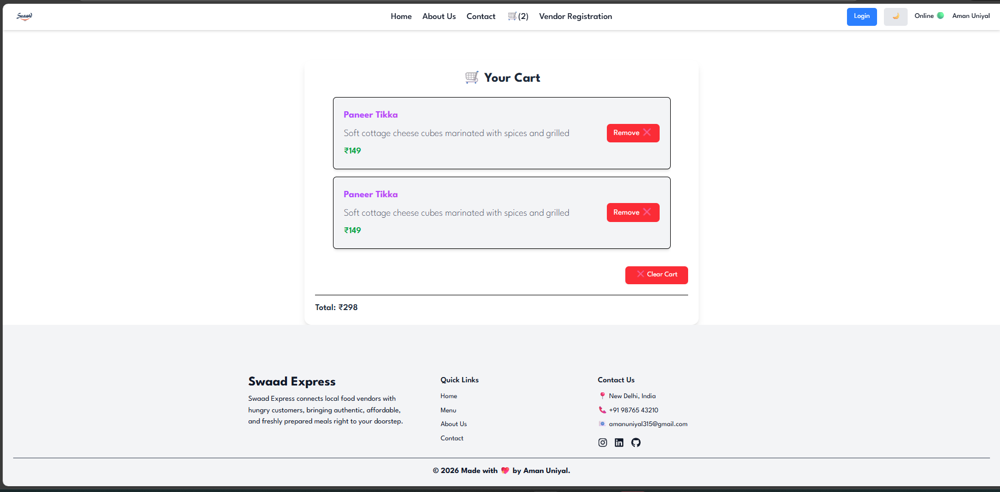
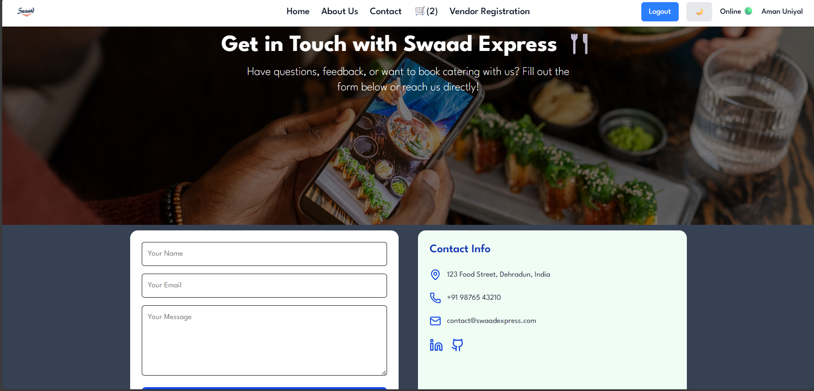
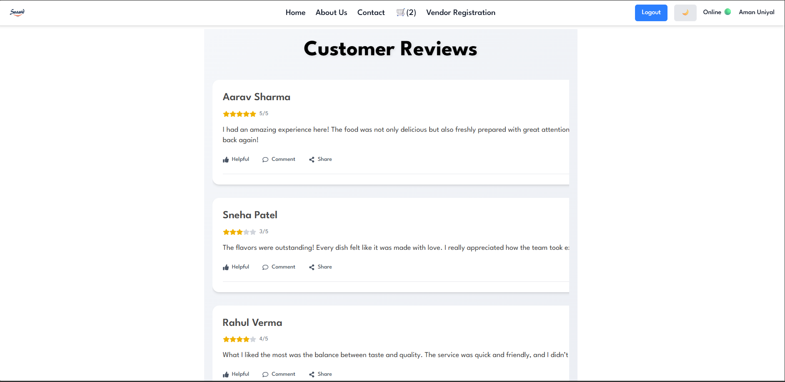

🍛 Swaad Express – Indian Food Ordering Platform(Frontend)

Swaad Express is a modern,  food ordering web application UI focused on authentic Indian cuisine.
It allows users to explore a wide variety of Indian restaurants, discover regional dishes, manage their cart, and place orders seamlessly — all with a clean UI, dark/light mode, and smooth user experience.

✨ Features
🏠 Home & Restaurant Discovery

Browse Indian restaurants from different regions

Beautiful, responsive UI inspired by modern food apps

Fast loading and smooth navigation

🍽️ Rich Indian Cuisine

North Indian, South Indian, Street Food, Sweets & more

Detailed restaurant menus with pricing and images

Category-wise food listings

🛒 Smart Cart System

Add/remove items instantly

Quantity management

Real-time cart updates

🔐 Authentication

Secure Login / Sign Up flow

User session handling

Protected routes

🧑‍🍳 Vendor / Restaurant Registration

Vendors can register their restaurants

Add menus and manage listings (planned )

🌙 Dark / ☀️ Light Mode

Toggle between Dark and Light themes

Smooth UI transitions

User-friendly for long browsing sessions

🛠️ Tech Stack

Frontend: React.js, Tailwind CSS

State Management: Redux Toolkit

Routing: React Router

Backend / APIs: Firebase

Authentication: Firebase Auth 

Hosting: Firebase Hosting

## 🏠 Home Page

---

## 🍴 Restaurants

---

## 📖 Restaurant Menu

---

## 📖 Restaurant Menu

---
## 📖 About Us

---

## 🛒 Cart

---

## 📞 Contact Us

---

## 💬 Reviews

---

## 🔐 Login

